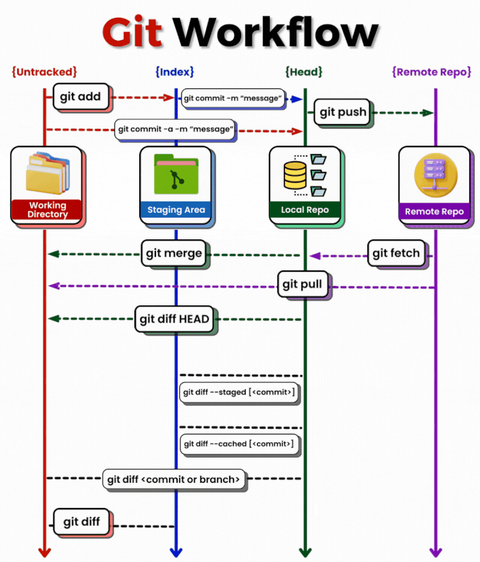

# Git & GitHub

## Learning Objectives

Learn how you can connect your local Git repositories with a GitHub repository
to add more structure to your development process and to share your projects.

- 🥚 **Licenses**: You can ...
  - [ ] Explain why it's important to include a license for your code on GitHub
  - [ ] Choose a license for your projects that matches how you want others to
        use your code
- [ ] 🥚 **GitHub SSH Key**: You can connect your computer to your GitHub
      account using an SSH key, clone using the SSH link, and push/pull using
      your SSH connection.
- 🥚 **GitHub Repositories**: You can ...
  - [ ] Create new repository on GitHub
  - [ ] Write a description for your repository
  - [ ] Turn on GitHub Pages
  - [ ] Configure your repository to block pushing to `main`
  - [ ] Configure your repository to block merging to `main` until Continuous
        Integration (CI) checks have passed
- 🥚 **Git Remote/Local Connection**: You can ...
  - [ ] Clone a remote repository to your computer using
        `git clone <remote-url>`
  - [ ] initialize a new repository locally and connect it to an empty remote
        repository
  - [ ] `git push` command is used to upload local repository content to a
        remote repository
  - [ ] `git fetch` a primary command used to download contents from a remote
        repository
  - [ ] `git pull` command downloads the changes directly and then applies those
        changes to the current working files
  - [ ] `push` and `pull` changes between remote & local branches
  - [ ] You can distinguish between `git fetch` and `git pull`
- [ ] 🥚 **Pull Requests**: You can create a pull request between two branches
      in your repository and merge changes without causing any conflicts.
- [ ] 🥚 **PR templates**: You can use a PR template to add a checklist to all
      of your PRs so you are sure the code is great before merging to `main`.
- [ ] 🥚 **Continuous Integration**: You can use GitHub Actions to check your
      code's quality before merging a pull request to the `main` branch.
- [ ] 🐣 **Local/Remote Branching Workflow**: You can use a branching workflow
      that keeps mistakes away from the `main` branch and prevents conflicts
      from happening in GitHub. For each contribution to the project you can ...
  1. Check out a new local branch and write your code
  2. Check out `main` on your local machine
  3. Pull changes from remote `main` to local `main`
  4. Merge changes locally from `main` to your new branch
     - Fix any conflicts on your new branch before pushing!
  5. Format and lint your code
  6. Push your new local branch to your remote repository
  7. Open a Pull Request from the new branch to `main`
     - Go through the PR's checklist to make sure everything is correct
     - Make sure all CI checks pass!
  8. Merge your new remote branch to `main`
     - You can delete the branch after it's merged if you want to